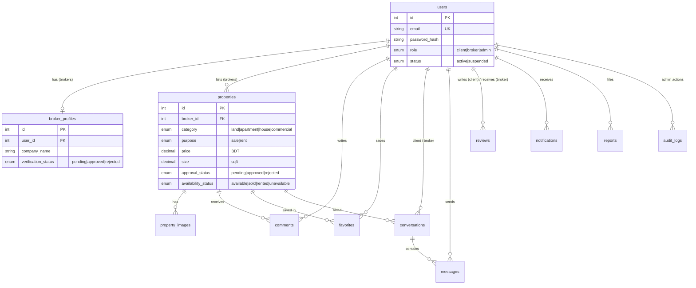

**Deletion rules:** deleting a user cascades to their profile, properties, comments, favorites and messages. Deleting a property cascades to images, comments and favorites, but keeps its conversations (property_id becomes NULL). Audit logs survive admin deletion (admin_id becomes NULL).
